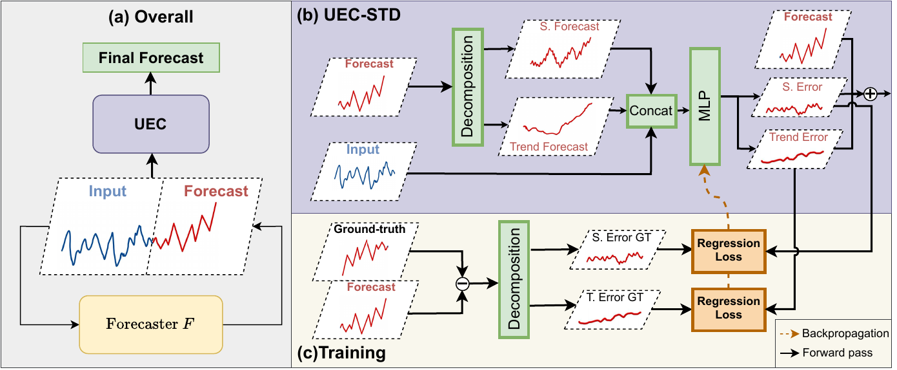

# TimeSeriesECM



TimeSeriesECM augments a forecasting backbone with an **Error Correction Module (ECM)** that learns to predict the residual between the backbone forecast and the ground truth, then adds a scaled version of that residual back to improve accuracy on long-term time series forecasting.

Built on top of [Time-Series-Library](https://github.com/thuml/Time-Series-Library).

---

## Installation

```bash
conda create -n timeecm python=3.8
conda activate timeecm
pip install -r requirements.txt
```

## Supported Datasets

Scripts are provided for the following benchmark datasets:

| Dataset | Script directory |
|---|---|
| ETT (ETTh1, ETTh2, ETTm1, ETTm2) | `scripts/long_term_forecast/ETT_script/` |
| ECL (Electricity) | `scripts/long_term_forecast/ECL_script/` |
| Weather | `scripts/long_term_forecast/Weather_script/` |
| Traffic | `scripts/long_term_forecast/Traffic_script/` |
| Exchange Rate | `scripts/long_term_forecast/Exchange_script/` |
| Solar Energy | `scripts/long_term_forecast/Solar_script/` |
| ILI | `scripts/long_term_forecast/ILI_script/` |

Use the standard benchmark dataset layout expected by Time-Series-Library. Point `--root_path` to the dataset directory and `--data_path` to the target CSV file.

## Supported Backbone Models

The ECM module supports the following backbone architectures:

iTransformer, Mamba, PatchTST, TimeBridge, TimeMixer, TimesNet, TimeXer, TSMixer

Other models are available as plain backbone-only baselines (no ECM) via the non-`_test` scripts.

---

## Quick Start

All `*_test.sh` scripts share the same positional argument signature:

```bash
bash ./scripts/long_term_forecast/<Dataset_script>/<Model>_<Dataset>_test.sh \
  <mode> <use_ar> <pred_len> [errcor_coef] [ecm_model] [season_coef] [trend_coef]
```

Arguments in `[brackets]` are optional for certain modes (see per-mode details below).

### Step 1 — Train the backbone model

Train the backbone at its native prediction length (`pred_len = seq_len`). This saves a `checkpoint.pth` that all subsequent modes load.

```bash
bash ./scripts/long_term_forecast/<Dataset_script>/<Model>_<Dataset>.sh
```

Example:

```bash
bash ./scripts/long_term_forecast/ETT_script/TimeMixer_ETTh1.sh
bash ./scripts/long_term_forecast/Weather_script/TimeMixer.sh
bash ./scripts/long_term_forecast/ECL_script/iTransformer.sh
```

---

### Step 2 — Run inference or train/evaluate the ECM

Choose the mode that matches what you want to do.

---

#### Mode 0 — Evaluate backbone on test set (no training)

Loads the backbone checkpoint and runs evaluation directly. No ECM involved.

```
bash ..._test.sh 0 <use_ar> <pred_len>
```

```bash
bash ./scripts/long_term_forecast/ETT_script/TimeMixer_ETTh1_test.sh 0 1 336
```

---

#### Mode 1 — Train backbone then evaluate

Trains the backbone from scratch, then immediately evaluates it on the test set.

```
bash ..._test.sh 1 <use_ar> <pred_len>
```

```bash
bash ./scripts/long_term_forecast/ETT_script/TimeMixer_ETTh1_test.sh 1 1 336
```

---

#### Mode 2 — Autoregressive inference with backbone only

Loads the backbone checkpoint and runs multi-step autoregressive inference to cover the requested `pred_len`, using the backbone's native step size. No ECM involved.

```
bash ..._test.sh 2 <use_ar> <pred_len>
```

```bash
bash ./scripts/long_term_forecast/ETT_script/TimeMixer_ETTh1_test.sh 2 1 336
```

---

#### Mode 3 — Train ECM

Runs the backbone autoregressively over the training set to collect residuals, then trains the ECM to predict those residuals. The best error-correction coefficient is selected automatically on a validation split and encoded in the saved ECM checkpoint name.

`season_coef` and `trend_coef` are not used in this mode.

```
bash ..._test.sh 3 <use_ar> <pred_len> <errcor_coef> <ecm_model>
```

```bash
bash ./scripts/long_term_forecast/ETT_script/TimeMixer_ETTh1_test.sh 3 1 336 1 linear
```

---

#### Mode 4 — Evaluate ECM

Loads both the backbone checkpoint and the trained ECM checkpoint, then evaluates the combined model on the test set.

`season_coef` and `trend_coef` are not used in this mode.

```
bash ..._test.sh 4 <use_ar> <pred_len> <errcor_coef> <ecm_model>
```

```bash
bash ./scripts/long_term_forecast/ETT_script/TimeMixer_ETTh1_test.sh 4 1 336 1 linear
```

---

#### Mode 5 — Train ECM with seasonal and trend decomposition

Same as mode 3, but the residual is decomposed into seasonal and trend components before training. The ECM learns to correct each component separately. `season_coef` and `trend_coef` weight the two loss terms.

```
bash ..._test.sh 5 <use_ar> <pred_len> <errcor_coef> <ecm_model> <season_coef> <trend_coef>
```

```bash
bash ./scripts/long_term_forecast/ETT_script/TimeMixer_ETTh1_test.sh 5 1 336 1 linear 0.8 0.2
```

---

#### Mode 6 — Evaluate ECM with seasonal and trend decomposition

Same as mode 4, but loads and evaluates the seasonal/trend ECM checkpoint trained in mode 5.

```
bash ..._test.sh 6 <use_ar> <pred_len> <errcor_coef> <ecm_model> <season_coef> <trend_coef>
```

```bash
bash ./scripts/long_term_forecast/ETT_script/TimeMixer_ETTh1_test.sh 6 1 336 1 linear 0.8 0.2
```

---

### Typical workflows

**Backbone only (no ECM):**
```
Step 1 (train)  → Mode 0 or 2 (eval)
```

**Standard ECM:**
```
Step 1 (train backbone) → Mode 3 (train ECM) → Mode 4 (eval ECM)
```

**Seasonal/trend ECM:**
```
Step 1 (train backbone) → Mode 5 (train ECM) → Mode 6 (eval ECM)
```

---

## Script Arguments

| Position | Argument | Description |
|---|---|---|
| 1 | `mode` | Run mode (0–6, see above) |
| 2 | `use_ar` | Autoregressive decoding (`1` = enabled) — only meaningful for modes 2–6 |
| 3 | `pred_len` | Forecast horizon length |
| 4 | `errcor_coef` | Error-correction coefficient — optional for modes 0, 2 |
| 5 | `ecm_model` | ECM architecture (e.g. `linear`) — optional for modes 0, 2 |
| 6 | `season_coef` | Seasonal loss weight — only used in modes 5, 6 |
| 7 | `trend_coef` | Trend loss weight — only used in modes 5, 6 |

---

## Autoregressive Decoding (`use_ar`)

`use_ar` is only meaningful for modes 2–6, which run a multi-step AR loop to cover horizons longer than the backbone's native `pred_len`. Modes 0 and 1 do a single forward pass and ignore this argument entirely.

When the AR loop is active:

- **`use_ar=1`** — true autoregressive: the model's own output from step `j` is fed as input to step `j+1`. This matches real test-time conditions where ground truth is not available.
- **`use_ar=0`** — teacher forcing: the ground truth window is used as input at each step instead. This gives an oracle upper bound showing what the model could achieve without compounding AR errors.

For training the ECM (modes 3 and 5), using `use_ar=1` is recommended so the ECM is trained on residuals that reflect the same error regime it will see at evaluation time.

---

## Error-Correction Coefficient

The `errcor_coef` controls how strongly the ECM residual is blended into the backbone forecast:

| Value | Behaviour |
|---|---|
| `-1` | **Auto** — use the best coefficient found during training (default) |
| `0` | No correction — returns the backbone forecast unchanged |
| `> 0` | Manual override — scales the ECM residual by this value |

### Automatic coefficient selection (modes 3 and 5)

`errcor_coef` is ignored entirely during training — modes 3 and 5 always run a full search regardless of what value is passed. The code searches a list of candidate coefficients on a held-out validation split and saves the best-performing one in the ECM checkpoint filename:

```
checkpoint-modelerr-linear-found-best-coeff-0.3-MSE.pth
```

Pass a comma-separated list of candidates via `--error_flags` (default: `0.01,0.03,0.05,0.07,0.1,0.3,0.5,0.7,1`). Each candidate is evaluated against both MSE and MAE criteria.

### At evaluation time (modes 4 and 6)

With the default `errcor_coef=-1`, the code reads the coefficient directly from the checkpoint filename and applies it automatically — no manual input needed. You can override this with any positive value to test different blend strengths without retraining.

---

## CLI Reference

Key flags defined in [run.py](run.py):

| Flag | Description |
|---|---|
| `--task_name` | Task type (e.g. `long_term_forecast`) |
| `--is_training` | Run mode (0–6) |
| `--model_id`, `--model` | Experiment ID and backbone model name |
| `--data`, `--root_path`, `--data_path` | Dataset name and file paths |
| `--seq_len`, `--label_len`, `--pred_len` | Input, label, and forecast lengths |
| `--use_ar` | Enable autoregressive decoding |
| `--checkpoints` | Directory for saving model checkpoints |
| `--alpha` | Temporal smoothing factor between consecutive autoregressive steps |
| `--errcor_coef` | Runtime error-correction coefficient |
| `--ecm_model` | ECM model architecture (e.g. `linear`, `CNN`, `RNN`) |
| `--err_h` | Hidden dimension of the ECM model |
| `--kernel_size` | Kernel size for moving-average decomposition (seasonal/trend ECM) |
| `--season_coef`, `--trend_coef` | Loss weights for seasonal and trend components in ECM training |
| `--error_flags` | Comma-separated candidates for automatic coefficient selection |
| `--wandb` | Enable Weights & Biases logging (`True`/`False`) |
| `--use_dtw` | Include DTW metric in evaluation |

---

## Outputs

| Output | Description |
|---|---|
| `result_long_term_forecast.txt` | Text summary of all evaluation runs |
| `metrics.npy` | Saved metric arrays (MAE, MSE, RMSE, MAPE, MSPE) |
| `pred.npy` / `true.npy` | Predictions and ground truth |
| PDF plots | Per-setting figures saved under `./scratch/` |
| ECM results (modes 3–4) | Written to `./scratch/infer_results/<setting>-<ecm>/` |
| ECM results (modes 5–6) | Written to `./scratch/infer_results_seasonal_<s>_trend_<t>_<k>/<setting>-<ecm>/` |

---

## Repository Structure

```
models/          # Backbone model implementations
layers/          # Shared layer components
exp/             # Experiment runners (training, testing, ECM inference)
data_provider/   # Dataset loading utilities
scripts/
  long_term_forecast/
    ETT_script/          # ETTh1/h2/m1/m2 scripts
    ECL_script/          # Electricity dataset scripts
    Weather_script/      # Weather dataset scripts
    Traffic_script/      # Traffic dataset scripts
    Exchange_script/     # Exchange rate dataset scripts
    Solar_script/        # Solar energy dataset scripts
    ILI_script/          # ILI dataset scripts
run.py           # Main entry point
```
